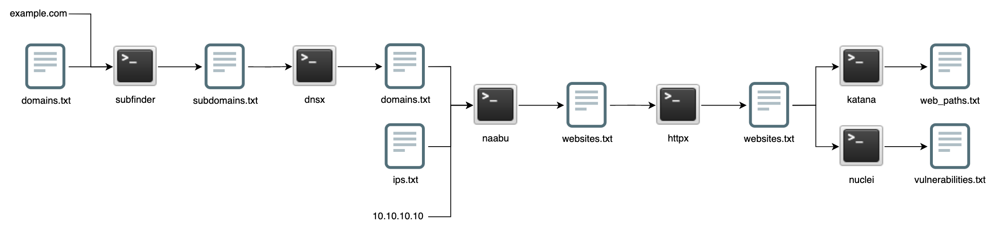

# discoveryx

Quick Python wrapper around some of the awesome [ProjectDiscovery](https://github.com/projectdiscovery) tooling.

```
       ___                                     _  __
  ____/ (_)_____________ _   _____  _______  _| |/ /
 / __  / / ___/ ___/ __ \ | / / _ \/ ___/ / / /   /
/ /_/ / (__  ) /__/ /_/ / |/ /  __/ /  / /_/ /   |
\__,_/_/____/\___/\____/|___/\___/_/   \__, /_/|_| v0.0.1
                                      /____/


usage: discoveryx.py [flags]

discoveryx -- v0.0.1

options:
  -h, --help            show this help message and exit

  -i IP, --ip IP        ip address to scan (comma-separated)

  -il IPLIST, --iplist IPLIST
                        list of ip addresses to scan (file)

  -d DOMAIN, --domain DOMAIN
                        domain to scan (comma-separated)

  -dl DOMAINLIST, --domainlist DOMAINLIST
                        list of domains to scan (file)

  --docker              run tools via Docker containers

  --setup               install tools and setup environment

  --update              update existing tool installs

  --debug               enable debugging
```

# Discovery Paths

<p align="center">
  
</p>

* **subfinder**: generate a set of all possible subdomains based on a given domain or set of domains
* **dnsx**: filter active domains from the given set of passive (sub)domains
* **naabu**: scan for open http/s ports based on a given ip/domain or set of ips/domains
* **httpx**: filter active domains running http/s webservers based on the given set of ips/domains
* **katana**: crawl all potential paths based the given set of webservers
* **nuclei**: scan for vulnerabilities based the given set of webservers

## Tool Arguments

* [**subfinder**](discoveryx/modules/subfinder.py#L27): `-silent`
* [**dnsx**](discoveryx/modules/dnsx.py#L27): `-silent`
* [**naabu**](discoveryx/modules/naabu.py#L30): `-silent -ports-file resc/common-http-ports.txt`
* [**httpx**](discoveryx/modules/httpx.py#L27): `-silent -nc -status-code -title -tech-detect`
* [**katana**](discoveryx/modules/katana.py#L27): `-silent`
* [**nuclei**](discoveryx/modules/nuclei.py#L29): `-silent -json -o nuclei.json`

## Tool Installation Locations

discoveryx expects the ProjectDiscovery tools to be located in the `~/.discoveryx/tools/` directory. If a tool is not found, the `--setup` flag can be run to install all missing dependencies.

# Credits

This tool is based comlpetely off of the work of [ProjectDiscovery](https://github.com/projectdiscovery) and is only meant to be a quick wrapper around their existing tooling to chain them all together. There are numerous bash examples that exist, this was just a reason to play around with each of the tools.